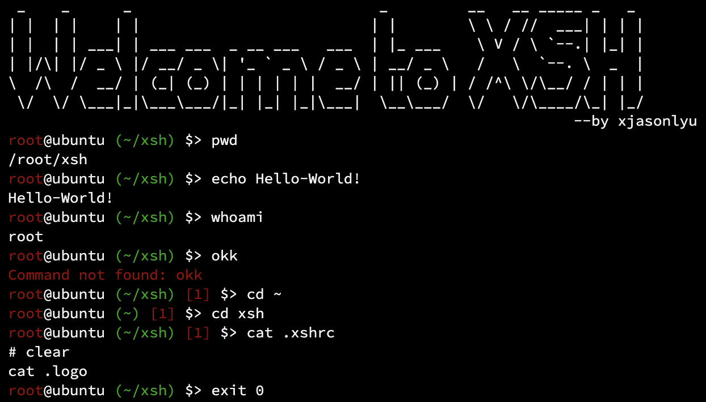

# XSH

## Preview

## Features

- `.xshrc` Support
- Colorful Prompt
- `SIGINT` Handler
- Exit on EOF
- Last Subprocess Status
- Stdin/Stdout Pipelines
- Stdout Redirection
- Builtin: `cd` `exec` `exit` `help`
